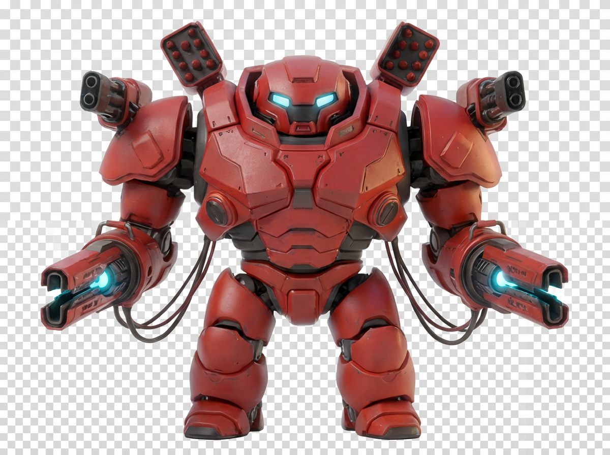

<p align="center">
  
</p>

<h1 align="center">@hexaclaw/cli</h1>

<p align="center">One command to add AI cloud tools to all your coding assistants.</p>

<p align="center">
  <a href="https://www.npmjs.com/package/@hexaclaw/cli"></a>
  <a href="https://github.com/actgent/hexaclaw-cli/blob/main/LICENSE"></a>
</p>

---

Web search, image/video/audio generation, browser automation, vector storage, memory, email — added to Claude Code, Cursor, Gemini CLI, Windsurf, VS Code, Zed, Cline, Continue.dev, and OpenClaw in one shot.

## Quick Start

```bash
npx @hexaclaw/cli login
npx @hexaclaw/cli setup
```

Or install globally:

```bash
npm i -g @hexaclaw/cli
hexaclaw login
hexaclaw setup
```

## What It Does

`hexaclaw setup` auto-detects which AI coding tools you have installed and configures the [HexaClaw MCP server](https://github.com/actgent/hexaclaw-cli) for each one. One API key, all your tools.

### Supported Tools

| Tool | Config Location | Detection |
|---|---|---|
| **Claude Code** | `claude mcp add` / `~/.claude/settings.json` | `claude` binary or `~/.claude/` |
| **Cursor** | `~/.cursor/mcp.json` | `~/.cursor/` or `/Applications/Cursor.app` |
| **Gemini CLI** | `~/.gemini/settings.json` | `gemini` binary or `~/.gemini/` |
| **Windsurf** | `~/.codeium/windsurf/mcp_config.json` | `~/.codeium/windsurf/` or app |
| **VS Code (Copilot)** | `~/.vscode/mcp.json` | `code` binary or `~/.vscode/` |
| **Zed** | `~/.config/zed/settings.json` | `zed` binary or config dir |
| **Cline** | VS Code extension globalStorage | Extension installed |
| **Continue.dev** | `~/.continue/mcpServers/hexaclaw.json` | `~/.continue/` exists |
| **OpenClaw** | `~/.openclaw/mcp-servers.json` | `openclaw` binary or config dir |

## Commands

```
hexaclaw login     Authenticate with your HexaClaw API key
hexaclaw setup     Detect installed tools & configure MCP for each
hexaclaw status    Show which tools are configured + credit balance
hexaclaw logout    Remove stored credentials
```

## Available MCP Tools

Once configured, your AI coding assistant gets access to 18 tools:

| Tool | Cost | Description |
|---|---|---|
| `hexaclaw_search` | 1 cr | Web search |
| `hexaclaw_scrape` | 2 cr | Scrape URL to markdown |
| `hexaclaw_crawl` | 5 cr | Crawl site pages |
| `hexaclaw_read` | 1 cr | Read page as text |
| `hexaclaw_generate_image` | 1-10 cr | Image generation (Imagen 4, Flux, SD3.5, etc.) |
| `hexaclaw_generate_video` | 5-40 cr | Video generation (Veo 3, Kling, Minimax, etc.) |
| `hexaclaw_generate_audio` | 3 cr | Audio/music generation |
| `hexaclaw_tts` | 1-2 cr | Text to speech |
| `hexaclaw_chat` | varies | Chat with any LLM (Claude, GPT, Gemini, DeepSeek) |
| `hexaclaw_browser` | 2 cr/min | Cloud browser session |
| `hexaclaw_send_email` | 1 cr | Send email |
| `hexaclaw_embeddings` | 1-13 cr | Text embeddings |
| `hexaclaw_vector_upsert` | 1 cr/1K | Store vectors |
| `hexaclaw_vector_query` | free | Semantic vector search |
| `hexaclaw_memory_store` | 1 cr | Store a memory |
| `hexaclaw_memory_search` | free | Search stored memories |
| `hexaclaw_credits` | free | Check credit balance |
| `hexaclaw_models` | free | List available models |

## How It Works

1. **`hexaclaw login`** — saves your API key to `~/.hexaclaw/.env`
2. **`hexaclaw setup`** — detects installed tools, writes the correct MCP config for each one's format
3. Your AI tool launches the `hexaclaw-mcp-server` as a subprocess (stdio transport)
4. The MCP server forwards tool calls to the HexaClaw API

No daemons, no background processes. The MCP server runs only when your AI tool needs it.

## Requirements

- Node.js 18+
- A [HexaClaw](https://hexaclaw.com) account and API key

## License

MIT
